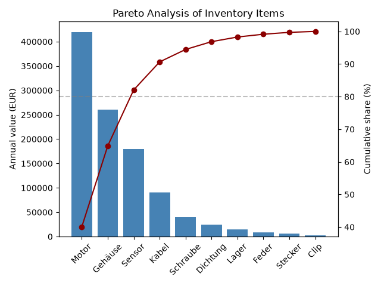

# IE Toolkit

A collection of industrial engineering calculation tools in Python —
inventory management essentials: EOQ, ABC analysis, and Pareto charts.



## Modules

| Module | What it does |
|---|---|
| `eoq.py` | Calculates the Economic Order Quantity — answers *"how much should I order per batch?"* |
| `abc_analysis.py` | Classifies inventory items into A/B/C classes by cumulative value share — answers *"which items deserve the most attention?"* |
| Pareto chart | Visualizes the ABC result: value bars + cumulative share curve with 80% threshold line |

## Example output

```
--- A-class order policy ---
Motor: order 283 units per batch (8.5 orders/year)
Gehäuse: order 447 units per batch (8.1 orders/year)
```

## How to run

```bash
pip install pandas matplotlib
python abc_analysis.py
```

Running `abc_analysis.py` demonstrates the full workflow:
ABC classification → Pareto chart → EOQ-based order policy
for A-class items.

## Tech stack

Python 3.13 · Pandas · matplotlib

## Planned additions

- Safety stock calculator
- OEE (Overall Equipment Effectiveness) module